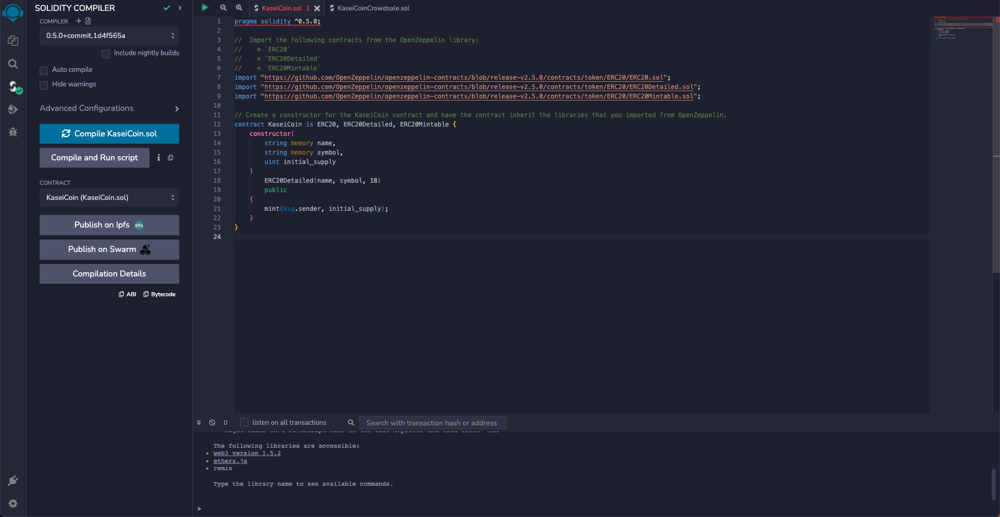
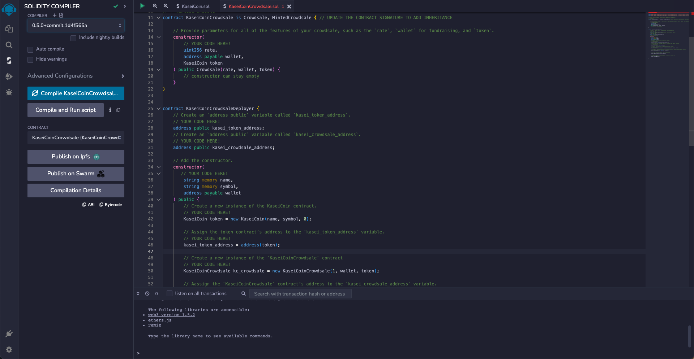
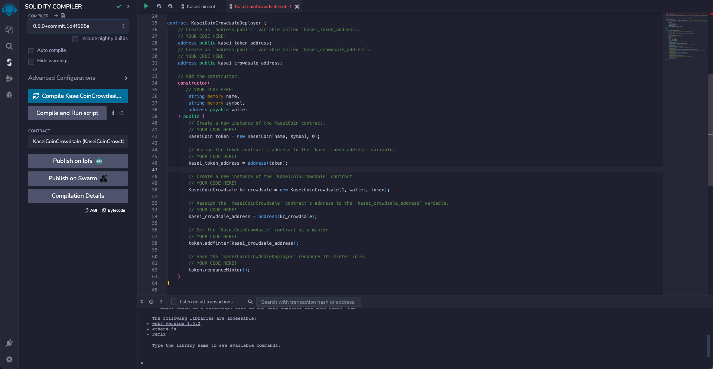
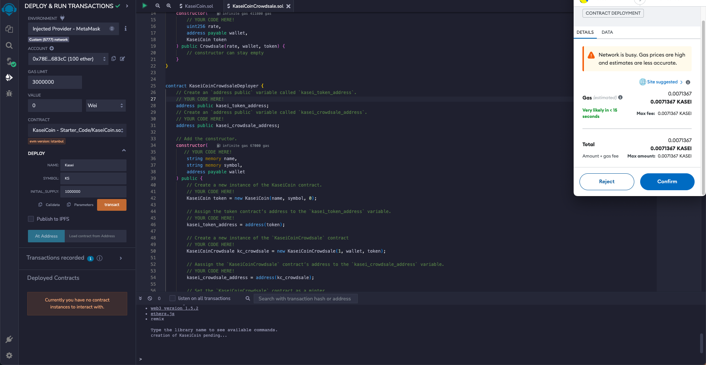
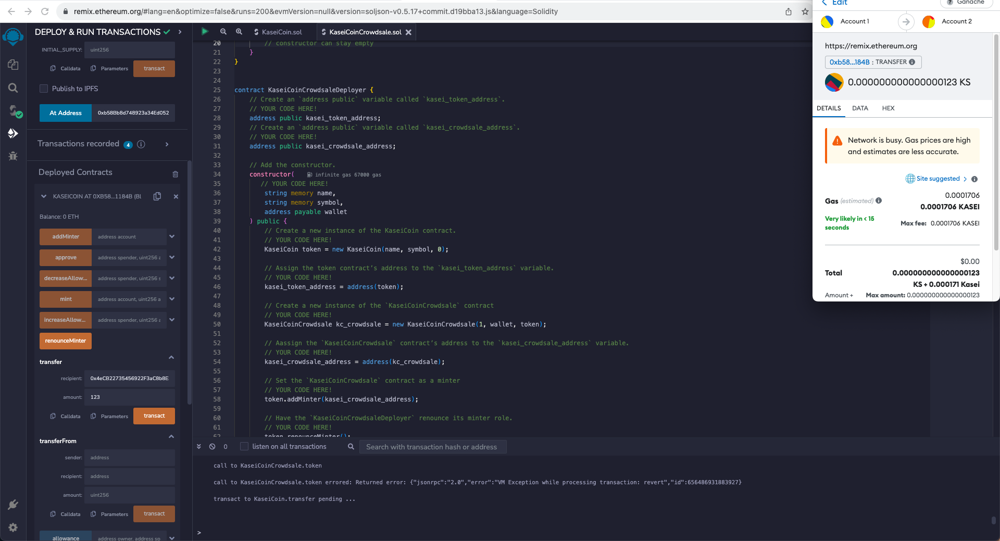
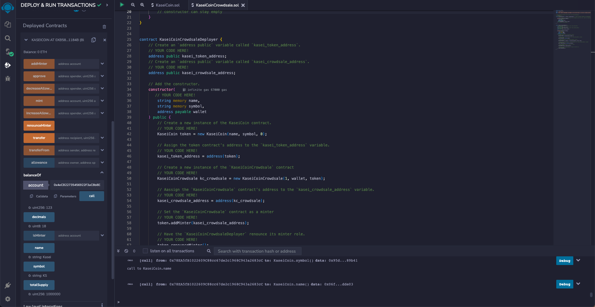

# Unit 21: Martian Token Crowdsale

## Step 1: Create the KaseiCoin Token Contract

## Step 2: Create the KaseiCoin Crowdsale Contract

## Step 3: Create the KaseiCoin Deployer Contract

## Step 4: Deploy and Test the Crowdsale on a Local Blockchain
### 1. Deploy the crowdsale to a local blockchain by using Remix, MetaMask, and Ganache.

### 2. Test the functionality of the crowdsale by using test accounts to buy new tokens and then checking the balances of those accounts.

### 3. Review the total supply of minted tokens and the amount of wei that the crowdsale contract has raised.
